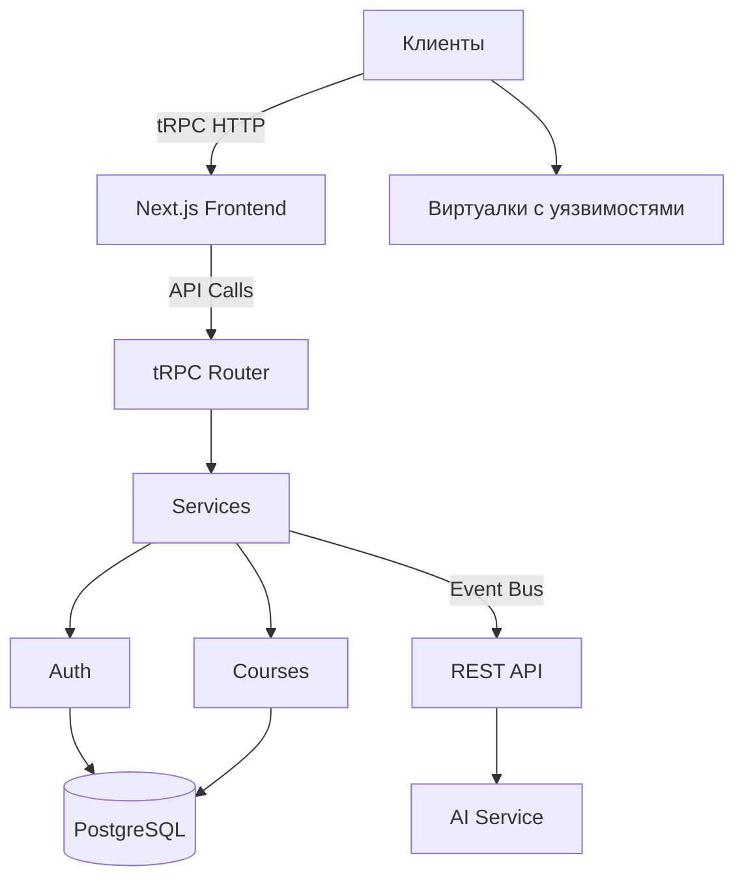
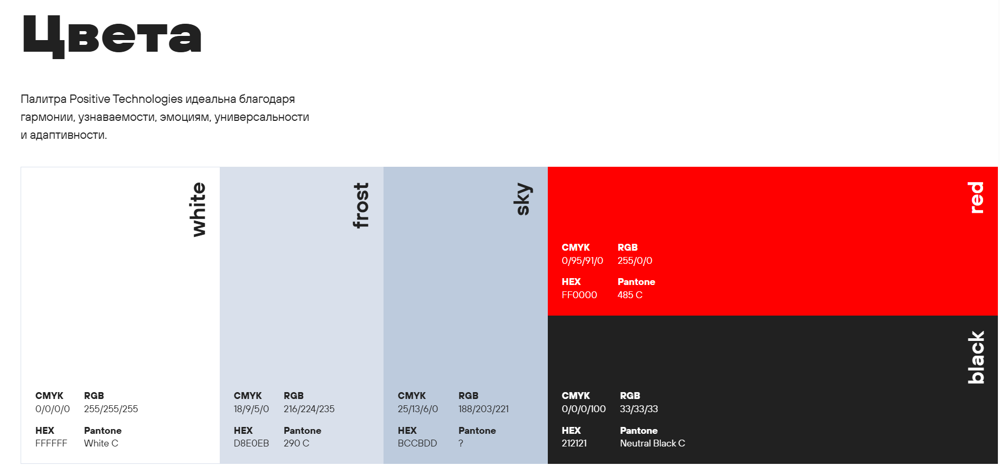

# Архитектура Next.js LMS (Fullstack)

1) Пользователь заходит в LMS и переходит на форму регистрации
2) Жмём кнопку зарегистрироваться
3) Проходит PoW-капча
4) У пользователя вылетает кнопка Регистрация по кошельку MetaMask
5) Пользователь входит в метамаск (пароль и seed-фраза хранится у метамаска)
- наша LMS получает от MetaMask адрес кошелька == это будет uuid чувака
6) Пользователь перебрасывает обратно в LMS, где он задаёт свой login
- наша LMS получает на хранение уникальный login
7) Регистрация завершена и пользователю повторно вылетает окошко, чтобы он запомнил все данные, восстановления не будет
- наша LMS получает на хранение временную метку регистрации (timestamp)
8) Пользователь попадает на страницу в LMS
- LMS генерирует сессионный токен (JWT), который привязывается к адресу кошелька и времени (время жизни токена 15-30 минут)

