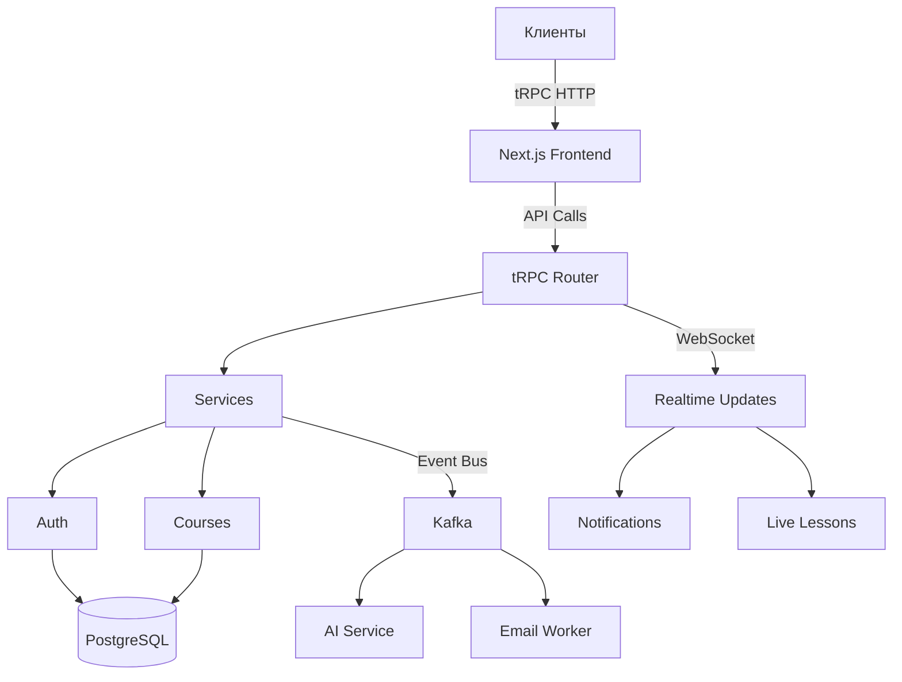

# Архитектура Next.js LMS (Fullstack)

```mermaid
flowchart TD
    A[Клиенты] -->|tRPC HTTP| B[Next.js Frontend]
    B -->|API Calls| C[tRPC Router]
    C --> D[Services]
    D --> E[Auth]
    D --> F[Courses]


    E --> I[(PostgreSQL)]
    F --> I

    C -->|WebSocket| L[Realtime Updates]
    L --> M[Notifications]
    L --> N[Live Lessons]

    D -->|Event Bus| O[Kafka]
    O --> P[AI Service]
    O --> Q[Email Worker]
```